# Approach Circle with Bézier Spline

This project is an example and demonstration of use of Bézier curve parameterization and application of numerical methods 
like Least Squares and Newton-Raphson in optimization problems. In the project, library
[numerical-analysis](https://github.com/iagerogiannis/numerical-analysis) is used. 

The object of the project is the parameterization of a curve with Bézier spline, which tends to approach the circle and
the minimization of the difference between the curve and the circle - target.

  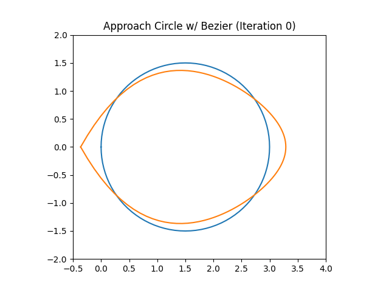

## The idea behind

At first a Bézier spline of 6 Control Points gets initialized. Our goal is to calculate the control point coordinates
which minimize the distance between the circle and the spline. The circle - target gets divided in n points which are at
a same distance angularly. For each one of these point, a straight line is being drawn from the center of the circle to
that point Ki. Then we calculate the intercept points Qi of the lines and the Bézier spline. Next we apply the Least
Squares method in order to minimize those radial distances KiQi.

  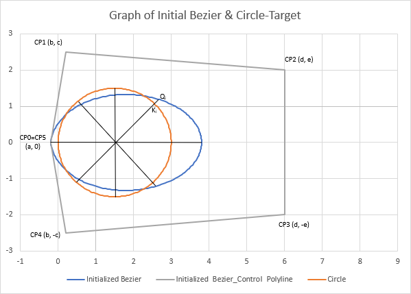

## Mathematical Formulation

### Parameterization

#### Parameterization of Bézier Spline

The curve is parameterized with a Bézier spline of 6 Control Points. In order to simplify the problem and minimize the
variables we exploit geometry symmetries, so that we have to define only 5 unknowns as shown in the graph above.

Bézier Spline's Control Points have the following coordinates:

  

Bézier Spline gets parameterized as follows:

  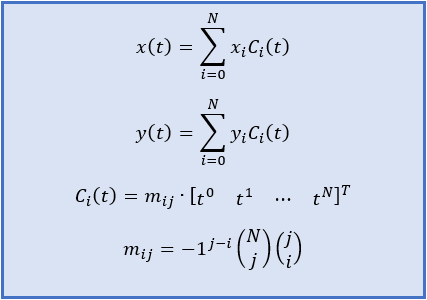

Performing the operations gives the following form of the final Bézier parameterization equations:

  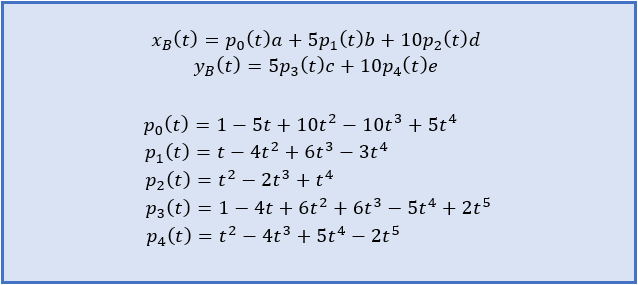

#### Parameterization of Circle

We choose to parameterize the circle as follows:

  

After discretization of the circle in n segments we get the coordinates of each j-th point:

  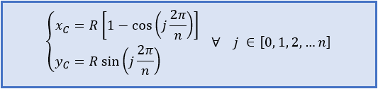

#### Parameterization of Straight Lines

For each straight line segment we need two points. We choose to express the points on the line as function of a parameter t.

  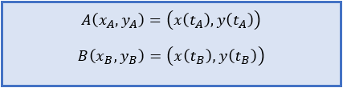

The parameterization of each straight line is the following:

  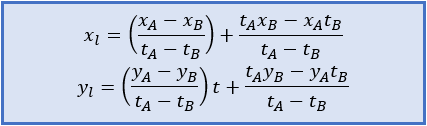

The lines we need, pass through the center of the circle and each j-th point on circle's circumference.  

### Calculation of Point Pairs Ki-Qi

For the Calculation of the point pairs Ki-Qi we use the Newton-Raphson Method for System 2x2:

  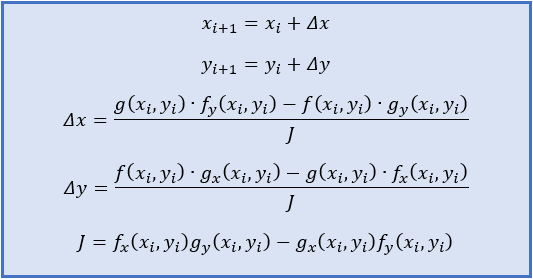

In order to calculate the intercept points between the Bézier curve and the line segments, we use the fact that on that point their parametric equations are equal:

  

So we set the functions f and g and we calculate their partial derivatives, which we give as input in Newton-Raphson method.

  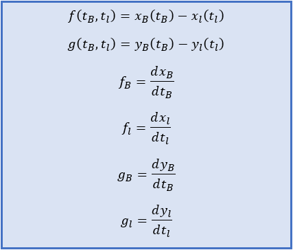

We repeat the process for each j-th point of the circle's circumference and the result is a set of Ki-Qi point pairs,
as shown in the figure above.

### Minimization of the distances Ki-Qi

In order for the Bézier curve to approach the circle, we need to minimize the sum of distances Ki-Qi. So we set the
following Error Functions.

  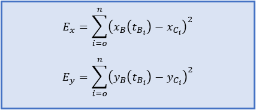

In order to find the parameters a, b, c, d, e, which minimize the error function their partial derivatives need to be equal to zero.

  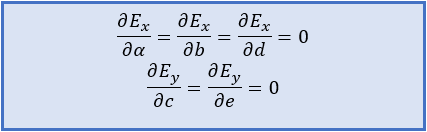

Substituting the parametric equations in Error Functions and performing the operations, we end up to the following systems of equations.

  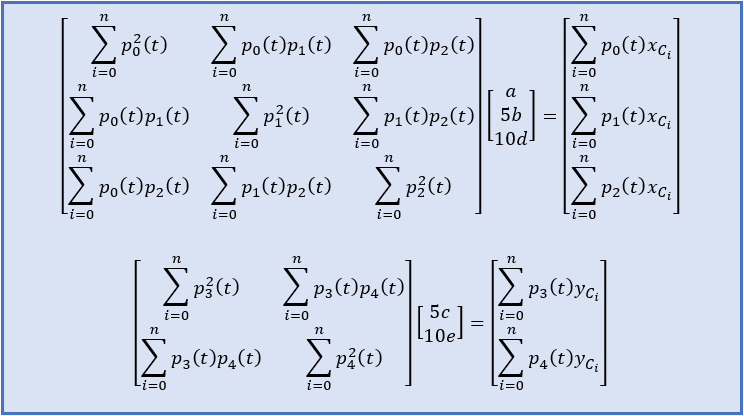

The solution of the above systems gives the parameters which minimize the distances Ki-Qi.
Repeating the whole process (refresh Bézier control points, calculation of new point pairs and solution of the new system)
gives a Bézier curve which approaches the circle even more.

## Results

Result

  

