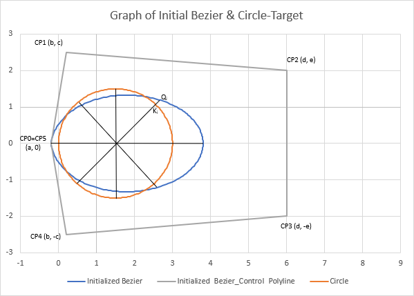

# Approach Circle with Bezier Spline

This project is an example and demonstration of application of numerical methods like Least Squares and Newton-Raphson
in optimization problems. 

The object of the project is the parameterization of a curve with Bezier spline, which tends to approach the circle and
the minimization of the difference between the curve and the circle - target.

## The idea behind

At first a Bezier spline of 6 Control Points gets initialized. Our goal is to calculate the control point coordinates
which minimize the distance between the circle and the spline. The circle - target gets divided in n points which are at
a same distance angularly. For each one of these point, a straight line is being drawn from the center of the circle to
that point Ki. Then we calculate the intercept points Qi of the lines and the Bezier spline. Next we apply the Least
Squares method in order to minimize those radial distances KiQi.

  

## Mathematical Formulation

Example

## Result

Result

  

