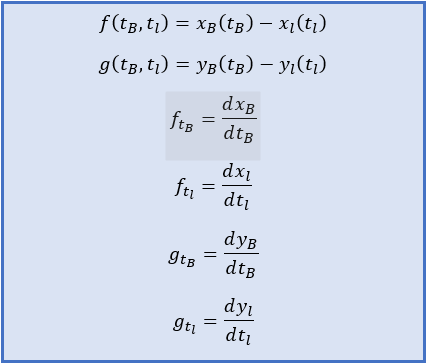

# Approach Circle with Bezier Spline

This project is an example and demonstration of application of numerical methods like Least Squares and Newton-Raphson
in optimization problems. 

The object of the project is the parameterization of a curve with Bezier spline, which tends to approach the circle and
the minimization of the difference between the curve and the circle - target.

## The idea behind

At first a Bezier spline of 6 Control Points gets initialized. Our goal is to calculate the control point coordinates
which minimize the distance between the circle and the spline. The circle - target gets divided in n points which are at
a same distance angularly. For each one of these point, a straight line is being drawn from the center of the circle to
that point Ki. Then we calculate the intercept points Qi of the lines and the Bezier spline. Next we apply the Least
Squares method in order to minimize those radial distances KiQi.

  

## Mathematical Formulation

### Parameterization

#### Parameterization of Bezier Spline

The curve is parameterized with a Bezier spline of 6 Control Points. In order to simplify the problem and minimize the
variables we exploit geometry symmetries, so that we have to define only 5 unknowns as shown in the graph above.

Bezier Spline's Control Points have the following coordinates:

  

Bezier Spline gets parameterized as follows:

  

Performing the operations gives the following form of the final Bezier parameterization equations:

  

#### Parameterization of Circle

We choose to parameterize the circle as follows:

  

After discretization of the circle in n segments we get the coordinates of each j-th point:

  

#### Parameterization of Straight Lines

For each straight line segment we need two points. We choose to express the points on the line as function of a parameter t.

  

The parameterization of each straight line is the following:

  

The lines we need, pass through the center of the circle and each j-th point on circle's circumference.  

### Calculation of Point Pairs Ki-Qi

For the Calculation of the point pairs Ki-Qi we use the Newton-Raphson Method for System 2x2:

  

In order to calculate the intercept points between the Bezier curve and the line segments, we use the fact that on that point their parametric equations are equal:

  

So we set the functions f and g and we calculate their partial derivatives, which we give as input in Newton-Raphson method.

  

We repeat the process for each j-th point of the circle's circumference and the result is a set of Ki-Qi point pairs,
as shown in the figure above.

### Minimization of the distances Ki-Qi

  

  

  

## Results

Result

  

